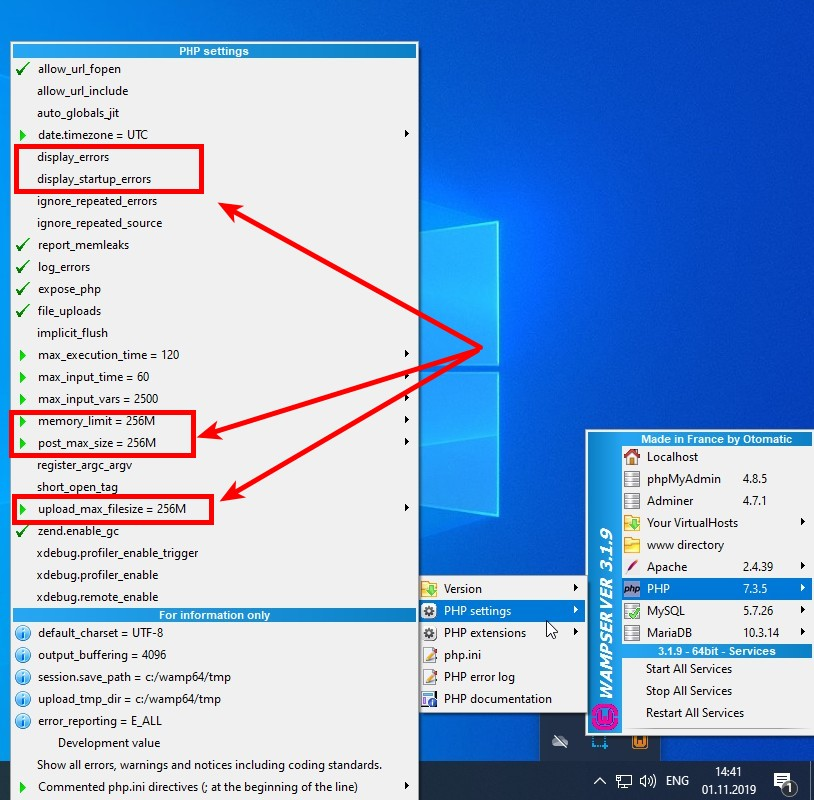
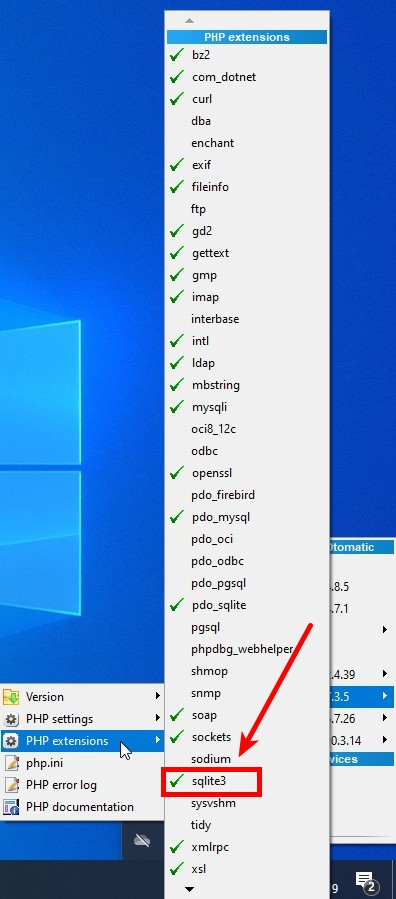
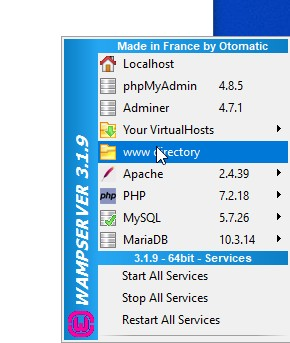
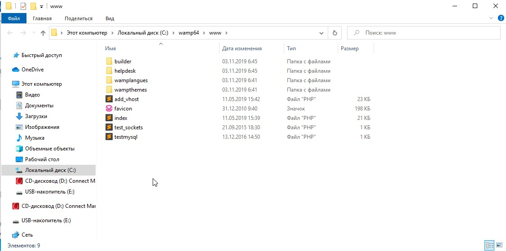
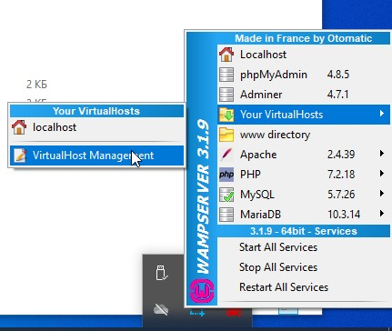
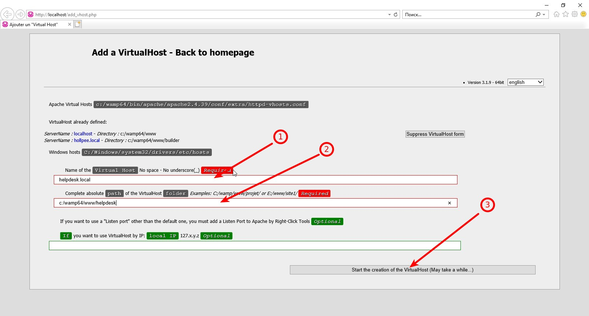
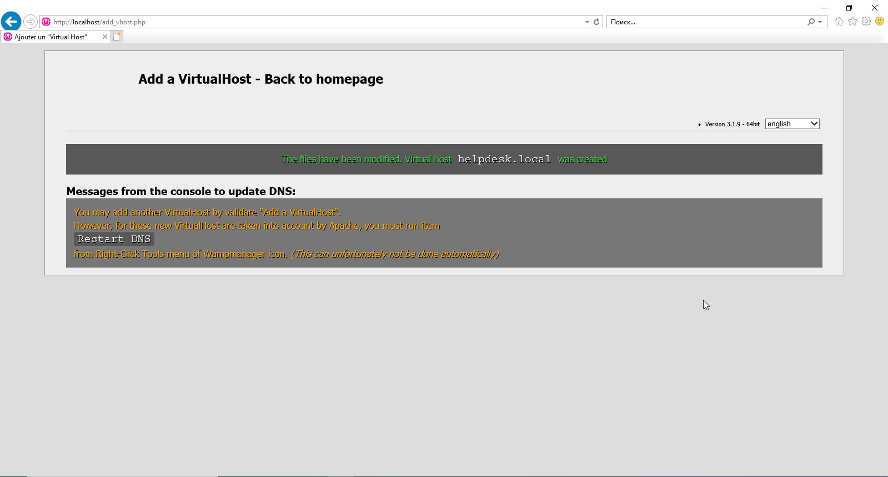
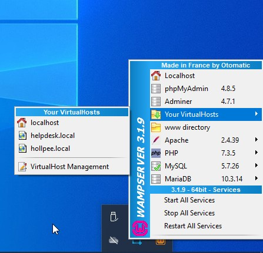
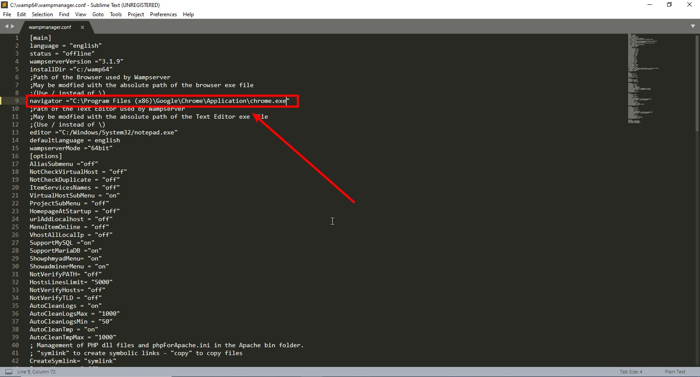

# Hollpee builder
Hollpee - позволит создавать профессиональные Landing Page с адаптивным дизайном. Сайт можно скачать и установить на свой хостинг вместе с CMS Hollpee. Она специально разработана для лендингов: визуальный редактор, мини CRM, интеграции, a/b тест и мультилендинги.

[База знаний редактора Hollpee builde](https://github.com/hollpee-builder/helpdesk)

В этой сборке убраны всё коммерческое состовляющее: регистрация нового пользователя, оплата, аккаунт консультанта и так далее. 

## УСТАНОВКА WINDOWS:

Для установки на Windows достаточно скачать любой локальный веб-сервер и настроить в нем:

    Версия PHP >= 5.6

Увеличить на максимум значения в файле php.ini, ниже указаны рекомендуемые значения:

    memory_limit=512M
    upload_max_filesize=512M
    post_max_size=128M

В некоторых локальных серверах нельзя будет выставить значение в 512, а только в 256, выставляйте на сколько получится.
Эти значения нужны, чтобы можно было загружать большие файлы в сервисе. 

    Так же вам необходимо включить модуль SQLite3

## Пример настройки для локального веб-сервера http://www.wampserver.com/ru/

Скачайте локальный веб-сервер и установите его.
Запустите его и настройте версию php = 7.3. 

Перейдите в Wampserver -> PHP -> PHP Settings и выключите галочки напротив display_errors, так же изменитене значение memory_limit, upload_max_filesize, post_max_size, как указано на скрине ниже.

Файл php.ini(PHP Settings):

Убедитесь, что был установлен модуль sqlite3, для этого кликните по Wampserver -> PHP -> PHP extensions -> sqlite3. Должна стоять галочка напротив sqlite3

Кликните на кнопку Wampserver -> www direcotry и создайте там папку внутри которой будет находится сервис. Для примера создайте папку "builder" в ней будет находиться сервис. Так же можете создать папку "helpdesk" в ней будет находиться база знаний. В итоге у вас внутри папки "C:\wamp64\www" должно находиться следующее:

Теперь откройте папку "builder" и загрузите туда все файлы сервиса, должно получиться следующее:

Аналогично можете сделать с папкой helpdesk, только внутрь нее нужно поместить базу знаний.
[База знаний редактора Hollpee builde](https://github.com/hollpee-builder/helpdesk)

Теперь если запустить Wampserver -> Your VirtualHosts -> Your VirtialHost Management.

То перед вами откроется менеджер настройки виртуальных хостов. Тут можно указать предпочитаемый домен, при переходе на который должен открыться сервис. Например это будет "hollpee.local" и так же необходимо указать полный путь к папке с сервисом. В данном примере это "C:\wamp64\www\builder", после ввода данных, как на скрине ниже вам нужно нажать на кнопку "Start the creation of the VirtialHost"

Аналогично с Базой знаний

Теперь вам необходимо перезагрузить программу Wampserver. Для этого закройте ее и снова откройте. После этого у вас в меню 
Wampserver -> Your VirtualHosts должны появиться созданные виртуальные хосты

Последняя настройка для этой программы. Откройте файл "C:\wamp64\wampmanager.conf". И отредактируйте строчку с словом navigator вначале строки, в ней будет указан путь к браузеру IE, вам нужно заменить его на Chrome:
Это нужно для того, чтобы в Wampserver по умолчанию использовался браузер Chrome
        
        navigator ="C:\Program Files (x86)\Google\Chrome\Application\chrome.exe"
        

Теперь если перейти в браузер и открыть сайт http://hollpee.local должен открыться редактор

Аналогично с Базой знаний, если открыть http://helpdesk.local

Версии установленных программ:

## УСТАНОВКА LINUX/UNIX:

Пример настройки для Debian:

    sudo apt install apache2 libapache2-mod-php7.0 php7.0 php7.0-mbstring php7.0-sqlite3 php7.0-zip

Настроить файл php.ini, изменив значение переменных, ниже приведены рекомендуемые значения:

    memory_limit=512M
    upload_max_filesize=512M
    post_max_size=128M 

Активировать модуль rewrite

    sudo a2enmod rewrite

Минимальная настройка для файла /etc/apache2/sites-enabled/000-default.conf

    <VirtualHost *:80>

      ServerName builder.local

       DocumentRoot /var/www/builder

       ErrorLog ${APACHE_LOG_DIR}/error.log

       CustomLog ${APACHE_LOG_DIR}/access.log combined

       <Directory /var/www/builder>

              Options -ExecCGI -Indexes -Includes +FollowSymLinks

               AllowOverride All

       </Directory>

    </VirtualHost>
    
Создайте папку /var/www/builder поместите в нее содержимое редактора Hollpee builder, назначте права доступа на эту папку

    chown www-data:www-data -R /var/www/builder
    chmod 770 -R /var/www/builder
Добавьте в файл /etc/hosts 

    127.0.0.1 builder.local
После этого Перезагрузите apache2

    sudo /etc/init.d/apache2 restart

Теперь если в браузере набрать builder.local должен открыть редактор

## Если у вас не загружается внутренний формат
Внутренние форматы сделанные до 2019-11-02 13:00 не будут загружаться в сервисе. Для того, чтобы их загрузить вам необходимо 
разархивировать архив. После этого у вас дожна появиться папка с названием вашего архива, зайдите в нее и в ней вы должны увидеть файлы и папки: file, fonts, images, avatar.png, hollpee_meta.txt, site.txt и так далее. Выберите все эти файлы и создайте zip ахив. После нужно изменить расширение с .zip на .hollpee. Теперь этот файл должен загрузиться в сервисе.

